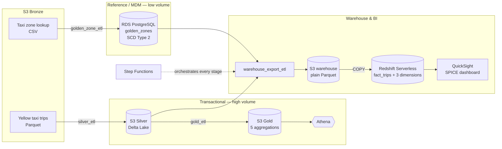

# NYC Taxi — Master Data Management & Analytics Platform on AWS

[](https://github.com/poojithaemani/Data_Pipeline_NYC_taxi_mdm/actions/workflows/ci.yml)

An end-to-end data platform that processes **2.85 million** NYC yellow taxi trips
through a medallion data lake, masters the taxi-zone reference data with full
SCD Type 2 version history, and serves the result as a Redshift star schema
behind a QuickSight dashboard — orchestrated by a single Step Functions
execution and deployed entirely through Terraform and GitHub Actions.

The interesting problem is not the volume. It is that two pipelines with very
different characteristics have to meet correctly: a high-volume transactional
flow that is reprocessed wholesale, and a low-volume reference flow where every
individual change must be preserved forever.

---

## Architecture



A separate `warehouse/` dataset exists because Redshift `COPY` cannot read Delta
Lake, and Gold is pre-aggregated with no dimensional keys — so it cannot supply
a trip-grain fact table. Exporting a plain-Parquet snapshot satisfies the
warehouse requirement without touching the Silver and Gold Delta tables.

Full detail: **[docs/architecture.md](docs/architecture.md)** ·
Design rationale: **[docs/project_overview.md](docs/project_overview.md)**

---

## What is validated

Every figure below comes from a full pipeline execution and is reconciled
across engines, not merely reported by a job that exited zero.

| Metric | Value |
|---|---|
| Silver rows / `fact_trips` / SPICE rows | 2,851,125 |
| `dim_zone` / `zone_matches` / `taxi_zones` | 265 |
| `dim_date` (gap-free calendar) | 33 |
| `dim_payment` (full TLC code set) | 7 |
| `SUM(fare_amount)` | 52,389,612.60 |
| `SUM(total_amount)` | 79,198,239.40 |
| Gold: daily / vendor / borough / payment / hourly | 33 / 95 / 203,611 / 128 / 748 |

**18 of 18** in-Redshift reconciliation checks pass, **33 of 33** days tie out
against the independently computed Gold tables in Athena on both trip count and
revenue, and SPICE ingests 2,851,125 rows with 0 dropped.

---

## Engineering decisions worth reading

- **Why `vendorid` is not mastered.** No authoritative vendor master exists, and
  the data contains a vendor code no available source can name. Creating a
  `dim_vendor` would mean inventing master data inside an MDM project — the
  precise thing MDM exists to prevent.
- **Why there is no surrogate trip key.** Silver has no stable natural trip
  identifier. A Redshift `IDENTITY` column would be worse than nothing: values
  are assigned non-deterministically across slices, so every reload would
  renumber every trip and the warehouse would stop being reproducible.
- **Why current records resolve by business key.** `zone_matches` points at a
  specific SCD2 version row and nothing repoints it when a new version
  supersedes it. Joining on that pointer silently drops every zone that has ever
  been updated — a bug that surfaced as a dimension one row short.
- **Why apply is manual.** The platform holds a reconciled multi-million-row
  warehouse and a private database with SCD2 history. Applying infrastructure
  changes because someone merged a commit is not a trade worth making.

---

## Stack

| Layer | Technology |
|---|---|
| Storage | S3 — Bronze / Silver / Gold / warehouse, Delta Lake on Silver and Gold |
| Compute | AWS Glue (PySpark and Python Shell) |
| Master data | RDS PostgreSQL — SCD Type 2 via a stored procedure, audit trigger |
| Warehouse | Redshift Serverless — star schema, `DISTSTYLE ALL` dimensions |
| Query | Athena over the Delta tables |
| BI | QuickSight — SPICE, 5 sheets, 28 visuals |
| Orchestration | Step Functions, EventBridge, CloudWatch, SNS |
| Security | KMS CMK, Secrets Manager, private subnet + NAT, TLS to RDS |
| IaC & CI/CD | Terraform (S3 remote state), GitHub Actions with OIDC |

---

## Deployment

No AWS access keys exist anywhere. GitHub Actions mints a short-lived OIDC
token and exchanges it for temporary credentials, and the IAM trust policy —
pinned to the repository and to the workflow context — is the security
boundary.

| Workflow | Trigger | AWS access |
|---|---|---|
| `ci.yml` | PR and push to `main` | **none** — format, validate, syntax, tests, secret scan |
| `terraform-plan.yml` | PR to `main` | OIDC, read-only |
| `terraform-apply.yml` | manual dispatch only | OIDC, write — typed confirmation + protected environment |

Two IAM roles back this because the blast radius differs by an order of
magnitude: a pull request can only ever reach the read-only plan role, while
the apply role is assumable solely from the protected `production` environment.

---

## Repository layout

```
pipeline/glue/jobs/   Deployed Glue job scripts
pipeline/ingestion/   Python reference-data ingestion orchestrator
services/database/    Schema, migrations, SCD2 procedure, audit trigger, tests
services/redshift/    Star-schema DDL, COPY script, reconciliation SQL
terraform/            Root configuration and wired modules
.github/workflows/    CI, Terraform plan, protected apply
docs/                 Architecture and design documentation
diagrams/             Draw.io architecture source
```

---

## Deliberately not built

- **No `dim_vendor`** — it would fabricate master data
- **No API layer** — consumers reach mastered data through the warehouse
- **No Kafka, Airflow, EMR, ECS or EKS** — the pipeline is batch and runs on
  demand; Step Functions and Glue cover it without adding a platform to operate
- **No streaming ingestion** — the source is published as periodic files

Known limitations are documented rather than hidden, each with a stated
decision and reason, in
[docs/project_overview.md](docs/project_overview.md#7-known-limitations).
