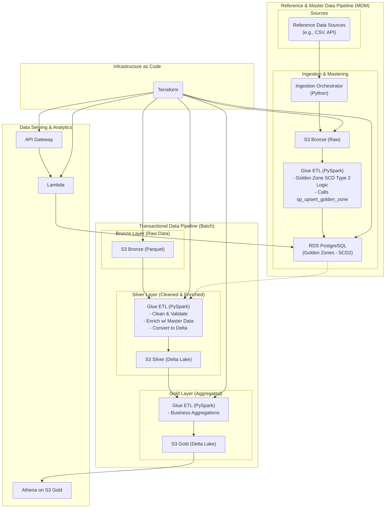

# Data Pipeline Architecture for NYC Taxi MDM

                    +----------------------+
                    |    Source Data       |
                    |  NYC Taxi CSV Files  |
                    +----------+-----------+
                               |
                               |
                               v
                    +----------------------+
                    |        Amazon S3     |
                    |----------------------|
                    | Bronze Layer         |
                    | Raw CSV Files        |
                    +----------+-----------+
                               |
                    Glue Crawlers (Metadata)
                               |
                               v
                    +----------------------+
                    |     AWS Glue Data    |
                    |       Catalog        |
                    +----------+-----------+
                               |
                               |
                    AWS Glue ETL Jobs
                               |
                               v
                    +------------------------+
                    |    Golden Zone ETL     |
                    |  golden_zone_etl.py    |
                    +-----------+------------+
                               |
                               |
                            Read CSV
                            Clean Data
                            Generate Hash
                               |
                               |
                               v
                    +----------------------+
                    | Aurora PostgreSQL    |
                    |----------------------|
                    | Stored Procedures    |
                    |                      |
                    | sp_upsert_golden()   |
                    +----------+-----------+
                               |
                               |
                               v
                    +-----------------------------+
                    | MDM Database                |
                    |-----------------------------|
                    | golden_zones                |
                    | taxi_zones                  |
                    | zone_matches                |
                    | SCD Type 2 History          |
                    +----------+------------------+
                               |
                               |
                          Glue Crawlers
                               |
                               v
                    +-----------------------------+
                    | AWS Glue Catalog            |
                    | Gold Tables                 |
                    +-------------+---------------+
                               |
                               |
                    +----------+-----------+
                    | Amazon Athena       |
                    | SQL Analytics       |
                    +----------+-----------+
                               |
                               |
                               v
                    +----------------------+
                    | Amazon QuickSight    |
                    | Dashboards           |
                    +----------------------+

This architecture consists of two main data flows:

1.  **Transactional Data Pipeline**: Processes high-volume NYC Taxi trip records.
2.  **Reference Data Ingestion**: Manages and masters reference datasets like taxi zones and vendors.

